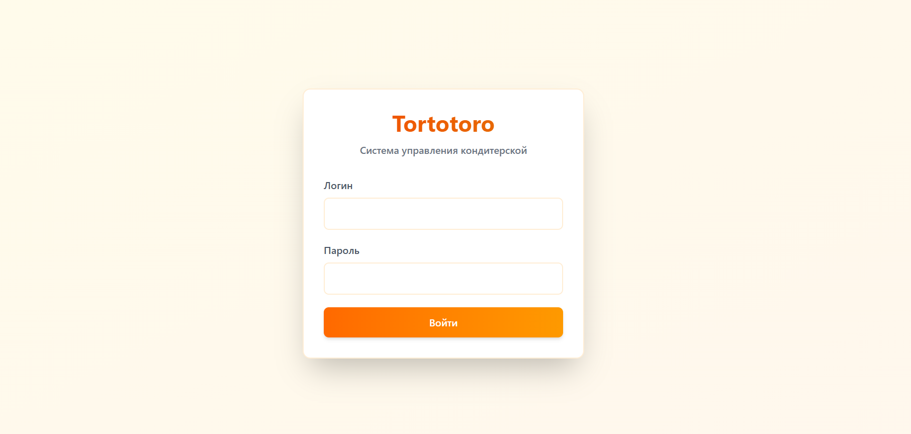
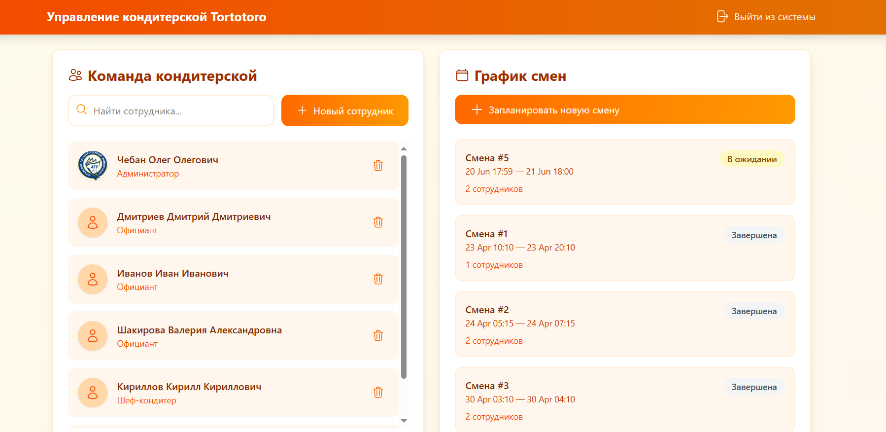
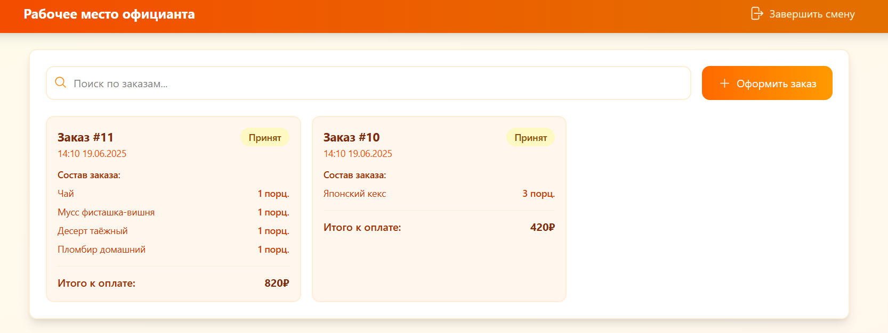
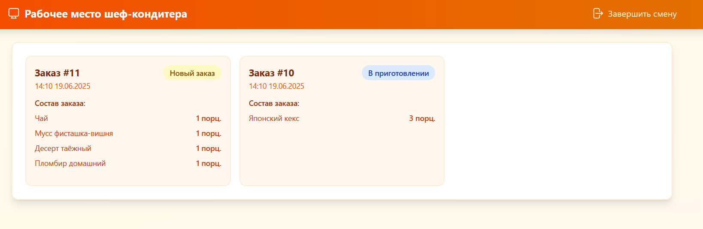

# Tortotoro - Pastry Shop Management System

## Project Overview

Tortotoro is a full-stack web application designed for managing a pastry shop. It includes four main pages:

### 1. Login Page (index.php)

- Description: The entry point of the application. Users can log in with their credentials.

- Image: 

### 2. Admin Panel (admin.php)

- Description: This panel allows administrators to manage employees (create, delete, search) and shifts (create, edit shift composition, change shift status to active or closed, etc.).

- Image: 

### 3. Waiter Panel (waiter.php)

- Description: Waiters can create new orders and update the status of existing orders.

- Image: 

### 4. Chief Panel (chief.php)

- Description: Chiefs (cooks) can update the status of orders (e.g., mark as in progress, ready, etc.).

- Image: 

## Tech Stack

The following technologies were used to build this project:

-  HTML5

-  CSS3

-  JavaScript

-  Bootstrap

-  MySQL

-  PHP

## Installation

To set up the project locally, follow these steps:

1. **Clone the repository** to your server (we used OpenServer for development):

```

git clone https://github.com/GapeevE/Tortotoro.git

```

2. **Create a MySQL database** using phpMyAdmin or any other database management tool.

3. **Import the database schema** from the provided `tortotoro.sql` file into your database. You can do this via phpMyAdmin by:

- Selecting your database.

- Clicking on the "Import" tab.

- Choosing the `tortotoro.sql` file and clicking "Go".

4. **Configure the database connection** by editing the `db_connect.php` file with your database credentials:

```php

<?php

$host = 'localhost'; // your host

$dbname = 'tortotoro'; // your database name

$username = 'root'; // your database username

$password = ''; // your database password


```

5. **Start your web server** (e.g., Apache in OpenServer) and navigate to the project directory.

6. **Access the application** via a web browser at `http://localhost/tortotoro/`.

### Default User Credentials

For testing purposes, you can use the following pre-defined users:

| Role    | Login        | Password     |

|---------|--------------|--------------|

| Admin   | cheban       | Admin123!    |

| Waiter  | shakilonil   | Offick123!   |

| Chief   | olga         | Povar123!    |

## License

This project is licensed under the MIT License. See the [LICENSE](LICENSE) file for details.